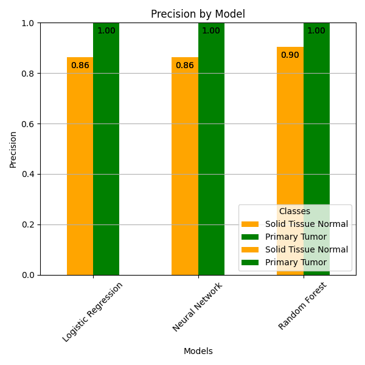
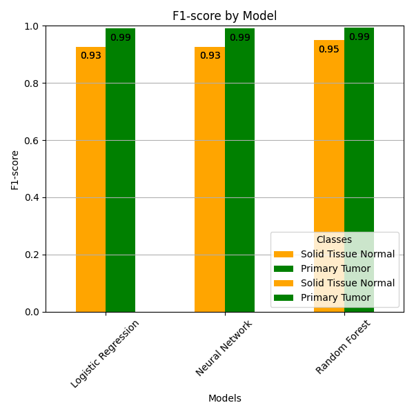
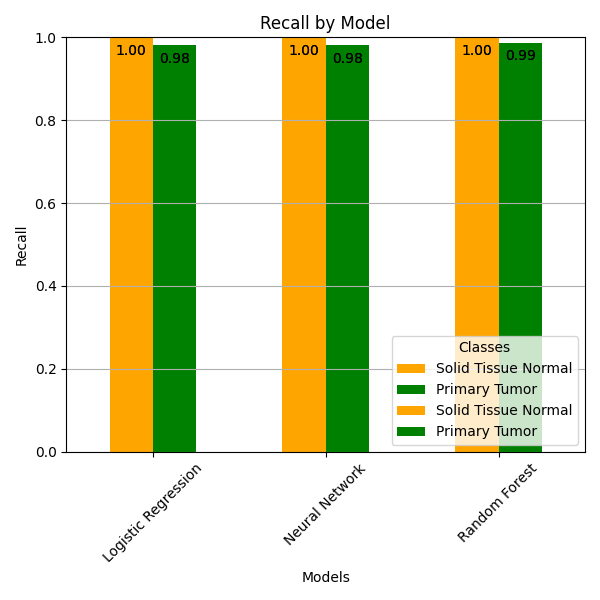

I ran three models for the gene expression dataset:

- logistic regression
- random forest
- forward feed neural network

Output is below. I also ran Boruta on a subset of the features (running on all 20000 will take many hours, so I excluded the bottom 50% with low gene expression to see if it makes a difference - it seems to help both the logistic regression and random forest, but not the neural network - more research is needed).

Here's some figures:





At a high level, it looks like logistic regression and random forest are the best bets for gene expression. We should try applying the models to the DNA Methylation data set, too.

You can run it by getting the code and running `python model.py`. Make sure you install the dependencies with `pip install -r requirements.txt`, see the [README.md]('./README.md') for more information.


```
=== Logistic Regression (all features) ===

Features: 20532
Accuracy: 0.97
Classification Report:
              precision    recall  f1-score   support

           0       0.78      0.95      0.86        22
           1       1.00      0.97      0.98       219

    accuracy                           0.97       241
   macro avg       0.89      0.96      0.92       241
weighted avg       0.98      0.97      0.97       241


=== Logistic Regression (boruta features only = 498) ===

Features: 499
Accuracy: 0.98
Classification Report:
              precision    recall  f1-score   support

           0       0.81      0.95      0.88        22
           1       1.00      0.98      0.99       219

    accuracy                           0.98       241
   macro avg       0.90      0.97      0.93       241
weighted avg       0.98      0.98      0.98       241


=== Random Forest (all features) ===

Features: 20532
Accuracy: 0.99
Classification Report:
              precision    recall  f1-score   support

           0       0.92      1.00      0.96        22
           1       1.00      0.99      1.00       219

    accuracy                           0.99       241
   macro avg       0.96      1.00      0.98       241
weighted avg       0.99      0.99      0.99       241


=== Random Forest (boruta features only = 498) ===

Features: 499
Accuracy: 1.00
Classification Report:
              precision    recall  f1-score   support

           0       0.96      1.00      0.98        22
           1       1.00      1.00      1.00       219

    accuracy                           1.00       241
   macro avg       0.98      1.00      0.99       241
weighted avg       1.00      1.00      1.00       241


=== Fowrard Feed Neural Network (all features) ===

Features: 20532
Epoch [10/100], Loss: 0.0000
Epoch [20/100], Loss: 0.0000
Epoch [30/100], Loss: 0.0000
Epoch [40/100], Loss: 0.0000
Epoch [50/100], Loss: 0.0000
Epoch [60/100], Loss: 0.0000
Epoch [70/100], Loss: 0.0000
Epoch [80/100], Loss: 0.0000
Epoch [90/100], Loss: 0.0000
Epoch [100/100], Loss: 0.0000
Test Accuracy: 0.98
Classification Report:
                     precision    recall  f1-score   support

Solid Tissue Normal       0.81      1.00      0.90        22
      Primary Tumor       1.00      0.98      0.99       219

           accuracy                           0.98       241
          macro avg       0.91      0.99      0.94       241
       weighted avg       0.98      0.98      0.98       241


=== Fowrard Feed Neural Network (boruta features only = 498) ===

Features: 499
Epoch [10/100], Loss: 0.0001
Epoch [20/100], Loss: 0.0000
Epoch [30/100], Loss: 0.0000
Epoch [40/100], Loss: 0.0000
Epoch [50/100], Loss: 0.0000
Epoch [60/100], Loss: 0.0000
Epoch [70/100], Loss: 0.0000
Epoch [80/100], Loss: 0.0000
Epoch [90/100], Loss: 0.0000
Epoch [100/100], Loss: 0.0000
Test Accuracy: 0.98
Classification Report:
                     precision    recall  f1-score   support

Solid Tissue Normal       0.79      1.00      0.88        22
      Primary Tumor       1.00      0.97      0.99       219

           accuracy                           0.98       241
          macro avg       0.89      0.99      0.93       241
       weighted avg       0.98      0.98      0.98       241

```
